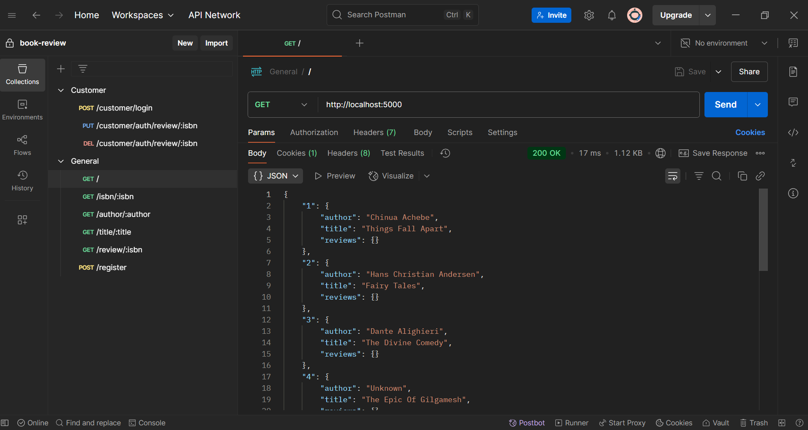

# Book Review 📚

A backend project building a **Bookstore REST API** with **Node.js** and **Express.js**.  
It handles user registration, login, book listings, and book search by ISBN, author, and title.

## Features ✅

1️⃣ **User Authentication:**
   - Register new users.
   - Login existing users with session management.

2️⃣ **Book Catalog:**
   - View all available books.
   - Search books by ISBN, Author, or Title.

3️⃣ **Book Reviews:**
   - Add, update, and delete book reviews (user-specific).

4️⃣ **Refactored Endpoints:**
   - Used **Promises** and **async/await** for better asynchronous handling.

## Screenshot 📸

Fetching all books using Promises on Postman

## What I Learned 📚

1️⃣ **Building REST APIs with Express:**
   - Implemented GET, POST, PUT, DELETE routes following RESTful conventions.

2️⃣ **Asynchronous Programming:**
   - Refactored classic callbacks to **Promise-based** and **async/await** style code.

3️⃣ **Session Handling:**
   - Managed user sessions for authenticated actions like reviewing books.

4️⃣ **Project Structuring:**
   - Organized routers, middlewares, and static book database cleanly.

5️⃣ **Error Handling:**
   - Improved API responses with consistent HTTP status codes and clear messages.

## Technologies Used 🛠️

- ⚙️ Node.js
- 🚂 Express.js
- 🧠 JavaScript (ES6+)
- 🔄 Promises and Async/Await
- 🛡️ REST API Principles
- 📨 Postman (for API testing)

## Conclusion 🎉

Built with passion by **Beniamin Hekimian**.  
Always happy to learn, improve, and build bigger things! 🚀